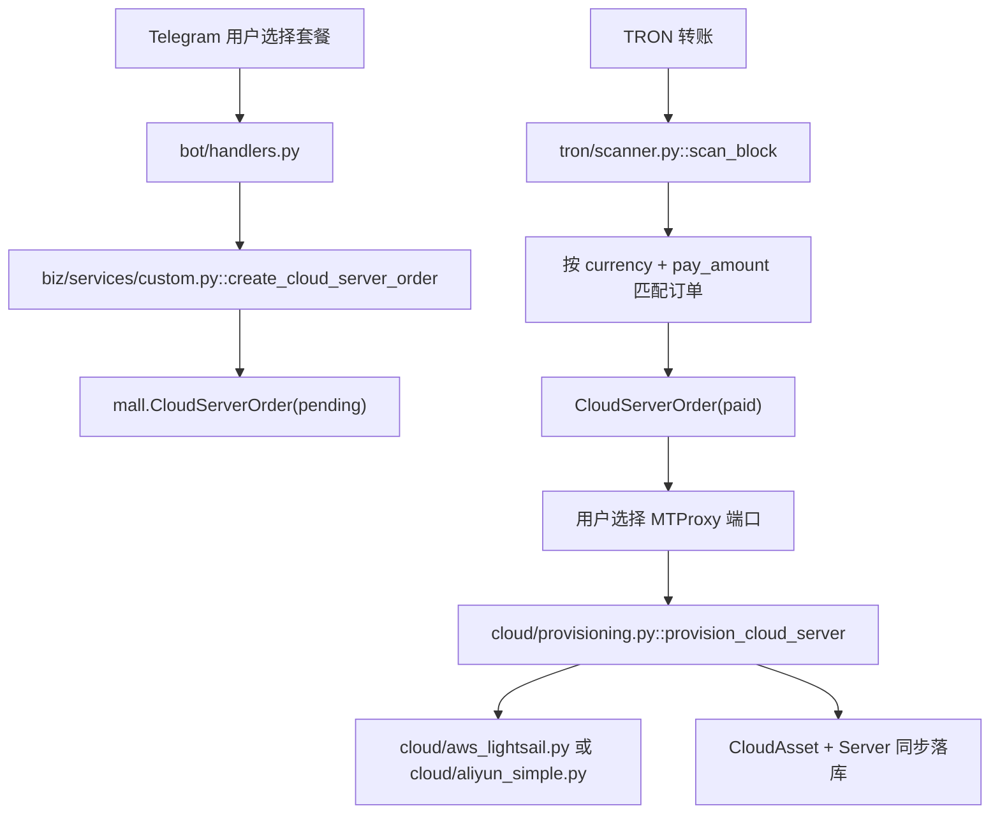
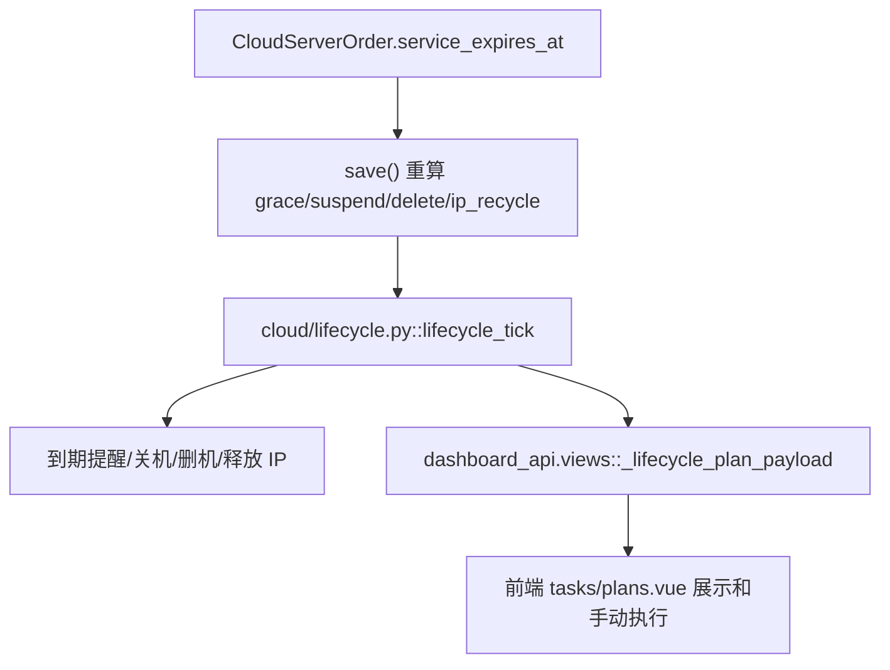

# 全量逻辑审计报告 2026-05-18

审计时间：2026-05-18 07:12:35 CST
范围：`/Users/a399/Desktop/shop/shop` 后端、`/Users/a399/Desktop/shop/vue-shop-admin` 前端、Telegram 机器人、TRON 扫链、云资源生命周期。
配套索引：[FILE_INVENTORY_2026-05-18.md](./FILE_INVENTORY_2026-05-18.md)

> 真实 AWS / TRON 动作只做只读核验与代码审计。本轮没有释放 `StaticIp-1 / 47.130.51.145`，也没有删除云端服务器。

## 1. 总览

系统由三条主链路构成：

1. 后台管理端：`vue-shop-admin/apps/web-antd/src/api/admin.ts` 调用 `dashboard_api/urls.py -> dashboard_api/views.py`，管理用户、云资产、云订单、生命周期计划、通知计划、Telegram 登录账号、系统配置。
2. Telegram 机器人：`bot/runner.py` 启动 `bot/handlers.py` 和 `bot/keyboards.py`，调用 `biz/services/*` 完成商品购买、充值、云服务器购买/续费/换 IP、地址监控。
3. 后台调度与外部同步：`bot/runner.py` 中 APScheduler 定时运行 `tron/scanner.py`、`tron/resource_checker.py`、`cloud/lifecycle.py`、`mall/management/commands/dedupe_servers.py`，并通过 AWS / Aliyun / TRONGrid 接口同步真实状态。

数据库当前使用 MySQL，配置入口在 `shop/settings.py`，通过 `core/runtime_config.py` 和 `core/models.py::SiteConfig` 支持数据库配置覆盖。

## 2. 关键调用关系

### 后台管理

- 前端路由：`apps/web-antd/src/router/routes/modules/admin.ts`
- 前端 API：`apps/web-antd/src/api/admin.ts`
- 后端路由：`dashboard_api/urls.py`
- 后端实现：`dashboard_api/views.py`
- 数据模型：`accounts/models.py`、`mall/models.py`、`finance/models.py`、`monitoring/models.py`、`core/models.py`

主要页面到接口：

- `/admin/cloud-assets` -> `getDashboardCloudAssetsApi` -> `cloud_assets_list`
- `/admin/cloud-assets/:id` -> `getDashboardCloudAssetDetailApi` / `updateDashboardCloudAssetApi` -> `update_cloud_asset`
- `/admin/tasks/plans` -> `getDashboardLifecyclePlanApi` / `runDashboardLifecyclePlan*Api` -> `lifecycle_plans` / `run_lifecycle_plan_item`
- `/admin/tasks/notices` -> `notice_plans` / `refresh_notice_plans` / `update_notice_*`
- `/admin/cloud-orders/list` -> `cloud_orders_list` / `cloud_order_detail` / `update_cloud_order_status`
- `/admin/cloud-accounts` 和 `/admin/settings/cloud-accounts` -> `cloud_accounts_list` / `verify_cloud_account`
- `/admin/telegram-accounts/*` -> `telegram_accounts` / `start_telegram_login` / `submit_telegram_login_code` / `submit_telegram_login_password`

### 云服务器购买与创建



### 生命周期删除与 IP 回收



## 3. 逐模块文件作用与风险

### `accounts/*`

- `accounts/models.py`：Telegram 用户、用户名历史、余额流水。风险：`TelegramUser.username` 是文本集合，另有 `TelegramUsername` 规范表，双写同步依赖 `biz/services/users.py`、`dashboard_api/views.py`、`bot/telegram_listener.py`，后续新增入口时容易漏同步。
- `accounts/services.py`：统一写余额流水。建议所有余额变动都继续走这里或 `_record_balance_ledger`，避免流水和余额不一致。
- `accounts/management/commands/backfill_usernames_to_users.py`：用户名回填命令，低风险。

### `mall/*`

- `mall/models.py`：核心业务模型。`CloudServerOrder.save()` 会自动根据 `service_expires_at` 重算 `renew_grace_expires_at/suspend_at/delete_at/ip_recycle_at`。
- 隐藏坑：后台手工改 `ip_recycle_at` 时，如果同时触发 `order.save()` 且 `service_expires_at` 存在，可能被 `save()` 重算覆盖。当前 `dashboard_api.views.cloud_order_detail` 对部分手动时间用 `QuerySet.update()` 绕过重算，文档要求后续继续保持这个习惯。
- `CloudAsset` 与 `Server` 是并行资产表，很多同步会双写。风险是局部更新只写一张表会造成列表不一致。
- `mall/management/commands/sync_aws_assets.py`：AWS Lightsail 实例和未附加 Static IP 同步。已确认会同步 `StaticIp-1 / 47.130.51.145` 为未附加 IP，不会自动释放。
- `sync_aliyun_assets.py`、`upsert_cloud_asset.py`、`dedupe_servers.py`：同步、手工补录、去重命令。生产运行前要注意它们会改库。

### `finance/*`

- `finance/models.py`：充值记录。注意 `Recharge` 没有 `updated_at` 字段，之前扫链代码不能保存 `updated_at`，本轮已确认相关保存没有再写这个字段。
- `biz/services/payments.py`：创建充值单，已设置 `expired_at = now + 15min`，避免永久待支付订单被误匹配。

### `biz/services/*`

- `commerce.py`：商品购物车、商品订单、唯一支付金额生成。已增强 `_generate_unique_pay_amount()`，会检查商品订单、充值、云服务器订单，减少尾数冲突。
- `custom.py`：云服务器套餐同步、下单、余额支付、端口设置。本轮修复 `_cloud_pay_amount()`，TRX 地址支付订单现在会把 USDT 售价换算为 TRX 后再加唯一尾数。
- `cloud_servers.py`：续费、换 IP、重装、自动续费开关、延期。续费金额已按用户折扣和币种计算。
- `cloud_queries.py`：用户云服务器查询，机器人列表依赖它。
- `monitoring.py`：地址监控 CRUD。
- `rates.py`：TRX/USDT 汇率来自 Binance，缓存 60 秒。风险：外部汇率接口失败且无缓存时，TRX 下单/续费会失败。
- `users.py`：用户创建和用户名合并。风险：多入口并发创建同 TG 用户时依赖唯一索引兜底，建议后续加事务重试。

### `bot/*`

- `bot/runner.py`：机器人入口和调度器。隐藏坑：`bot.delete_webhook(drop_pending_updates=True)` 会在重启时丢弃未处理 Telegram 更新，可能吞掉用户刚点的按钮或刚发的支付后续消息。建议改为配置项，生产默认 `False`。
- `bot/handlers.py`：机器人主逻辑。已修复云服务器地址支付文案，支付成功前现在显示订单真实 `pay_amount + currency`，避免用户把 TRX 转到 USDT 单或反过来。
- 仍需优化：套餐选择页在创建订单前仍显示“系统已开始自动监控 USDT 和 TRX 到账”，这里还没有订单尾数，建议改成“请选择支付方式/币种，创建订单后按订单金额支付”。
- `bot/keyboards.py`：按钮和 callback_data。风险：callback 字符串很多，没有集中枚举，改名时容易漏 handler。
- `bot/fsm.py`：Redis FSM 存储，含降级逻辑。
- `bot/telegram_listener.py`：登录账号监听、群组过滤、消息记录和推送。风险：配置存在 JSON SiteConfig 中，结构变更无 schema/migration 保护。

### `tron/*`

- `tron/parser.py`：解析 TRX 和 USDT 转账。
- `tron/scanner.py`：扫当前块、匹配支付、通知监控。已修复：
  - 过期商品订单、充值、云服务器订单会被排除。
  - `Order` / `Recharge` 保存不再写不存在的 `updated_at`。
  - 商品发货前检查库存，避免负库存。
  - 三类订单确认前全局检查 `tx_hash`，避免一笔交易重复入账。
  - 云服务器支付按 `currency + pay_amount` 匹配，修复 TRX 金额换算和跨币种误匹配。
- 仍需注意：扫链只拉 `getnowblock` 当前块，服务停机期间错过的块不会补扫。高可靠支付建议记录 last block number 并补扫区间。
- `tron/resource_checker.py`：资源巡检。本轮已确认 `getaccountresource` 响应 `data` 被正确解析并写外部同步日志。

### `cloud/*`

- `aws_lightsail.py` / `aliyun_simple.py`：创建真实云服务器、密码、开放端口。高风险：这些文件能真实创建资源。
- `bootstrap.py`：SSH 安装 BBR 和 MTProxy。
- `provisioning.py`：订单从 `paid` 到 `completed` 的编排，写入 `CloudAsset` 和 `Server`。已持久化 `static_ip_name`。
- `lifecycle.py`：真实关机、删机、释放 Static IP。已修复：
  - 删除/释放失败时不再把 DB 标成已删/已释放。
  - AWS 动作用 `server_name or instance_id or provider_resource_id` 定位实例。
  - 支持未附加 Static IP 资产释放入口，但需要后台手动执行，不能无确认乱点。
- 风险：真实云动作和 DB 状态仍靠字符串判断失败，建议后续返回结构化结果 `{ok, action, note}`。

### `dashboard_api/*`

- `urls.py`：后台 API 路由全集。
- `views.py`：后台 API 巨型文件，包含登录、配置、云资产、生命周期、通知、Telegram、订单、充值等逻辑。风险：
  - 文件过大，跨域逻辑多，新增功能很容易绕过已有校验。
  - `overview/users_list/products_list/orders_list/cloud_orders_list/cloud_assets_list/servers_statistics/recharges_list/monitors_list` 部分 GET 未显式加 `dashboard_login_required`，是否依赖上层路由鉴权需要确认。建议后台 API 默认全量鉴权，只放行登录/CSRF。
  - 云资产删除 `delete_cloud_asset` 是本地软删除，不会删除云端服务器；真实删机在 `delete_server` / 生命周期执行里。前端文案应继续明确“本地删除”和“云端删除”区别。
  - 生命周期接口已实现真实 payload，`run_lifecycle_plan_item` 可触发真实删机/释放 IP，前端需要二次确认并限制危险按钮。

### `core/*`

- `models.py`：`SiteConfig`、`CloudAccountConfig`、`ExternalSyncLog`。敏感配置会加密存储。
- `crypto.py`：Fernet 加解密。风险：`SECRET_KEY` 变化会导致历史敏感配置解不开。
- `runtime_config.py`：运行时配置读取，影响数据库、Redis 等启动配置。
- `cache.py`：Redis 配置缓存和每日统计。
- `cloud_accounts.py`：获取启用云账号，云同步/创建依赖。
- `persistence.py`：同步日志、每日地址统计、资源快照。

### `monitoring/*`

- `models.py`：地址监控、每日统计、资源快照。
- `cache.py`：监控地址 Redis 缓存，扫链依赖。风险：缓存异常时有 DB fallback，但实时性依赖定时刷新。

### 前端业务文件

- `apps/web-antd/src/api/admin.ts`：后台 API 类型和函数。与 `dashboard_api/urls.py` 基本对齐。
- `router/routes/modules/admin.ts`：后台菜单。云账号同时出现在一级菜单 `/admin/cloud-accounts` 和设置子菜单 `/admin/settings/cloud-accounts`，可访问但信息架构略重复。
- `views/dashboard/cloud-assets/index.vue`：代理列表。已历经多轮修复，本地删除不删云端；同步、编辑、风险视图仍需持续真机回归。
- `views/dashboard/tasks/plans.vue`：生命周期计划。已显示未附加 IP 未来计划。危险按钮会触发真实动作，必须保留二次确认。
- `views/dashboard/cloud-orders/index.vue`：云订单列表和编辑，已加入 `ip_recycle_at` 编辑。
- `views/dashboard/settings/cloud-accounts.vue`：云账号配置，可验证 AWS/Aliyun/TRONGrid。
- `views/dashboard/telegram-accounts/*.vue`：Telegram 登录账号、聊天记录、群组通知。
- `views/dashboard/settings/*.vue`：系统配置分组，依赖 `SiteConfig`。风险：很多配置是字符串，没有前端/后端统一 schema。
- `views/_core/authentication/login.vue`：后台登录。当前滑块验证被临时禁用/绕过，生产恢复前要重新启用或明确替代方案。

### 前端框架和工具链

- `packages/*`、`internal/*`、`scripts/*` 多数是 Vben monorepo 框架、UI、请求、状态、布局、构建、lint 工具。详见全量文件索引。它们不是当前业务逻辑核心，本轮做索引级审计和可达性检查，没有逐行重写。

### 临时脚本与敏感文件

- `shop/.env`、`shop/secrets/*`、`shop/tmp/*` 存在敏感配置、密钥、临时密码、真实 AWS 验证脚本。不要提交到公共仓库。
- `tmp/cleanup_aws_test_resources.py` 能真实释放 Static IP 和删除实例，只能人工确认后运行。

## 4. 本轮已修复的问题

1. `biz/services/custom.py`
   - 云服务器 TRX 地址支付订单现在先把 USDT 价格换算为 TRX，再生成唯一 `pay_amount`。
2. `tron/scanner.py`
   - 云服务器待支付订单按当前转账币种过滤，避免 TRX 数字误匹配 USDT 订单。
   - 云服务器匹配以 `order.pay_amount` 为准，保留唯一尾数。
3. `bot/handlers.py`
   - 云服务器地址支付成功前文案改为订单实际 `pay_amount + currency`，不再提示两个币种都可支付。

本轮之前已经修复并复核：

- TRON 资源巡检 `resp.json()` 解析缺失。
- 充值单过期时间。
- 商品/充值/云订单 `tx_hash` 重复确认。
- 商品支付库存检查。
- 生命周期删除/释放失败时不误标 DB 成功。
- AWS 未附加 Static IP 同步和后台生命周期展示。
- 云订单 `ip_recycle_at` 前后端编辑。

## 5. 仍建议处理的隐藏坑

按优先级：

1. **P0：后台 GET 接口鉴权一致性**
   - `dashboard_api/views.py` 中有多处后台数据 GET 只有 `@require_GET`，未直接标 `@dashboard_login_required`。
   - 建议除 `csrf/auth_login/me` 等必要公开接口外，后台 API 全部显式加鉴权，避免以后路由暴露。

2. **P0：机器人重启丢更新**
   - `bot/runner.py` 使用 `delete_webhook(drop_pending_updates=True)`。
   - 生产中可能丢用户刚发送的端口、按钮回调、充值指令。建议做成配置，默认不丢。

3. **P1：TRON 扫链缺少断点补扫**
   - 当前拉 `getnowblock`，机器人停机期间错过的块不会补偿。
   - 建议保存最后处理 block number，启动后从 last+1 到 now 补扫，并保留 tx_hash 幂等。

4. **P1：生命周期真实云动作结果应结构化**
   - 现在部分失败判断依赖 note 字符串包含“失败”。
   - 建议统一返回 `{ok: bool, provider, action, target, note}`，DB 状态只按 `ok` 变更。

5. **P1：`CloudServerOrder.save()` 自动重算生命周期字段容易覆盖手工值**
   - 后台已对 `ip_recycle_at` 用直接 update，但未来新增编辑字段时容易踩坑。
   - 建议将重算逻辑提成显式方法，或只在关键字段变化时重算。

6. **P1：前端危险操作权限和二次确认要统一**
   - 删除服务器、精准删除、释放未附加 IP 都可能触达真实云资源。
   - 建议统一危险操作组件，必须展示 provider / region / resource name / public_ip / irreversible note。

7. **P2：SiteConfig JSON 配置缺少 schema**
   - Telegram 账号、群组、按钮配置等存 JSON，结构变更依赖手写兼容。
   - 建议抽配置 schema 和迁移函数。

8. **P2：机器人 callback_data 缺少集中定义**
   - `bot/keyboards.py` 和 `bot/handlers.py` 字符串耦合。
   - 建议集中常量或小型编码/解析器，减少按钮可见但 handler 不匹配。

9. **P2：创建订单前的云服务器套餐支付文案**
   - 订单创建前页面仍有“监控 USDT 和 TRX 到账”的宽泛提示。
   - 建议改成“选择币种后生成唯一金额，按订单金额支付”。

10. **P2：敏感临时脚本和密钥清理**
    - `shop/tmp/*` 和 `shop/secrets/*` 有真实验证痕迹和密钥路径。
    - 建议加入清理清单，至少确保 `.gitignore` 覆盖。

## 6. 验证记录

已执行：

```bash
cd /Users/a399/Desktop/shop/shop
uv run python manage.py check
uv run python -m compileall tron biz bot cloud dashboard_api mall core accounts monitoring finance shop -q
```

结果：

- `manage.py check`：通过，`System check identified no issues`。
- `compileall`：通过。

未执行：

- 未执行真实 AWS 删除、Static IP 释放、TRON 主网转账。
- 未跑全量前端 typecheck，因为本轮重点是审计和文档；前序曾通过 `pnpm turbo run typecheck --filter=@vben/web-antd`。

## 7. 下一步建议

1. 先修 `dashboard_api/views.py` 的后台 GET 鉴权一致性。
2. 把 `drop_pending_updates=True` 改成配置项。
3. 给 TRON 扫链加 last block 持久化和补扫。
4. 把生命周期动作返回值结构化。
5. 用 Playwright 对后台所有业务页面做一次“只读按钮 + mock 危险按钮”回归，危险按钮只到确认弹窗，不执行真实云动作。
